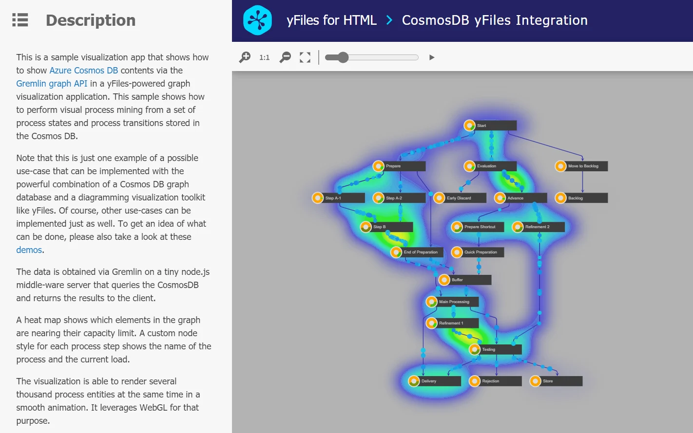

# Using Cosmos DB to visually analyze process networks

This repository contains the sources for a sample application for a yFiles use case about
connecting to and visualizing the contents of an Azure Cosmos DB.

## See also

- [Try the app online](https://live.yworks.com/demos/complete/processmining/) - the original demo
- [Learn more about yFiles](https://www.yworks.com/products/yfiles), the software library for visualizing, editing, and analyzing graphs
- [yFiles and CosmosDB](https://www.yworks.com/pages/visualizing-a-microsoft-azure-cosmos-db), more information about visualizing Cosmos DB graphs with yFiles

If you have any questions or suggestions, send an email to [consulting@yworks.com](mailto:consulting@yworks.com)
or call [+49 7071 9709050](tel:+4970719709050).

## How to run this app as a software developer

You need a copy of the [yFiles for HTML](https://www.yworks.com/products/yfiles-for-html) diagramming library in order
to run this application. You can download a free test version of yFiles in the
[yWorks Customer Center](https://my.yworks.com/signup?product=YFILES_HTML_EVAL).

## Details

This is a sample visualization app that shows how to show [Azure Cosmos DB](https://azure.microsoft.com/en-us/services/cosmos-db/) contents 
via the [Gremlin graph API](https://docs.microsoft.com/en-us/azure/cosmos-db/graph-introduction)
in a [yFiles](https://yworks.com/yfiles) powered graph visualization application. This sample shows how to perform visual process mining
from a set of process states and process transitions stored in the Cosmos DB.

Note that this is just one example of a possible use-case that can be implemented with the powerful combination of a Cosmos DB graph database 
and a diagramming visualization toolkit like yFiles. Of course, other use-cases can be implemented just as well. To get an idea of what 
can be done, please also take a look at these [demos](https://yworks.com/demos).

For this application, we need a bit of server-side NodeJS to actually connect to the database and then send the fetched data to the client,
which performs the visualization and animation. 
To articulate the server requirement in this demo there is a custom dev-server via [webpack](https://webpack.js.org). 
One could also setup a separate NodeJS project, or use one of the many
other [mid-tier technologies available for Cosmos DB](https://docs.microsoft.com/en-us/azure/cosmos-db/introduction), 
but this is just a simple JavaScript full-stack example and very easy to install and run.

The server code sits in the [`api`](./api) directory, and the relevant configuration to include the server API endpoints 
sits in [`webpack.config.js`](./webpack.config.js):

     devServer: {
       historyApiFallback: false,
       writeToDisk: true,
       port:3000,
       before: devServer => {
         devServer.use(apiServer);
       },
       after: devServer => {
         devServer.use(notFoundHandler);
       },
    }

Outside that the REST implementation is the very simplistic. You can find methods wrapping the Gremlin queries in the [`graphDB.js`](./api/graphDB.js) file.

### Setup

Make sure you have a [Cosmos DB emulation or Azure service](https://docs.microsoft.com/en-us/azure/cosmos-db/create-graph-nodejs).
Fetch the keys from the service and replace the environment vars in the [`.env`](./.env) file:

    GremlinEndpoint=wss://<your service>.gremlin.cosmosdb.azure.com:443/gremlin
    Key=<your key>
    Database=<your database>
    Container=<your graph/container>

If you are using the Cosmos DB Emulator, you can use the following setup

    GremlinEndpoint=ws://localhost:8901
    Key=C2y6yDjf5/R+ob0N8A7Cgv30VRDJIWEHLM+4QDU5DE2nQ9nDuVTqobD4b8mGGyPMbIZnqyMsEcaGQy67XIw/Jw==
    Database=db1
    Container=coll1

In order to add yFiles, you need to copy your files `license.json` in this directory and adjust the 
path to the yFiles npm module in the [`package.json`](./package.json), too.
Thereafter, run 

    npm i

or

    yarn

Then Use the `setup-database` npm script, project to [load some data into the graph](./setup/loading.js):

    npm run setup-database

or

    yarn setup-database

Once the data is loaded, you can launch the web application via

    npm run start

or

    yarn start

When the application loads, it will connect via the REST API to the built-in node.js server to first fetch the
possible states from the network stored in the Cosmos DB. The states will be represented as nodes in the applications.
A second fetch will collect all the transitions of items between the states recorded. These are relationships/edges in
the graph database. The app adds edge visualizations for all possible transitions and then animates the state
transitions over a given period of time, showing how the load distributes among the states in a heat map.  

Enjoy diagramming with [yFiles](https://yworks.com/yfiles)! 